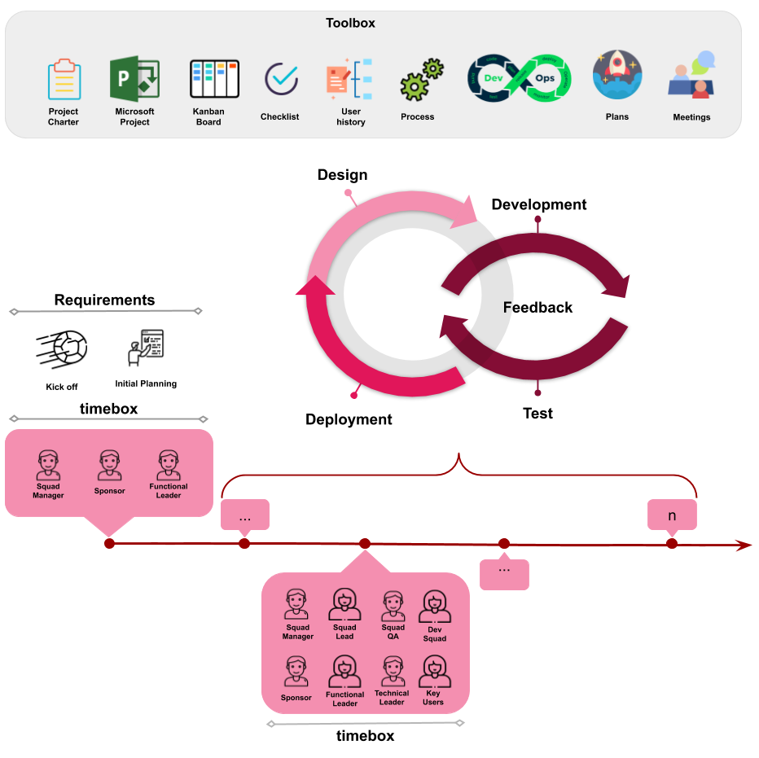

# Learn the new AG Methodology

The **AG Methodology** helps you manage your software projects, following the values listed below.

* **Individuals and interactions** over processes and tools
* **Working software** over comprehensive documentation
* **Customer collaboration** over contract negotiation
* **Responding to change** over following a plan

This methodology takes into account the [**twelve principles**](https://www.projectmanagement.com/wikis/295395/Agile-Manifesto-Values-and-Principles) of the agile manifesto.

Additionally, the AG includes predictive tools to do optimizes task in the Systems Development Life Cycle (SDLC).

## AG Methodology overview
***

For further details, you can visit the following sections.

* ### Teams/Squads
 
    * #### [**Roles**](roles/roles.md)
  
    * #### [**Interactions**](roles/Interactions.md)
  
* ### [**Meetings**](meetings/meetings.md)
* ### [**Toolbox**](toolbox/toolbox.md)