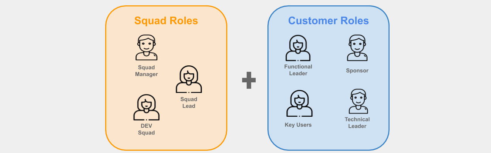

# Roles

The **AG methodology** includes the following roles to execute the tasks in each of the project phases.

## Squad Roles
***

???+ info
    These are the roles of the team that analyzes, designs, and develops the product.

|        **Role**        | **Description**                                                                                                                                                                                                                                                                       |
| :--------------------: | :------------------------------------------------------------------------------------------------------------------------------------------------------------------------------------------------------------------------------------------------------------------------------------ |
| **Squad Manager (SM)** | He/she is the one who leads the development team and verifies compliance with the **AG methodology**. This profile has certifications in predictive and agile frameworks. It is common to find **PMP** and **PMI-ACP** certified professionals or **Scrum Master** in this role.      |
|  **Squad Lead (TL)**   | He/she is in charge of the requirements and determines according to the priorities given by the **SM** how the team is going to advance. This profile has technical skills and is part of the development team getting to participate in the construction of the product or solution. |
|   **Squad QA (SQ)**    | He/She is in charge of product quality; this profile participates in each sprint, testing the development/product. QAs interact with the **development team (Dev Squad)**, report bugs, and testing with end-users.                                                                   |
|   **Dev Squad (SD)**   | They are professionals with the technical knowledge to carry out the project development tasks, complying with the requirements and user stories defined at the beginning of the sprint.                                                                                              |

## Customer Roles
***

???+ info
    These roles are interested in a successful result on the client-side and are in charge of reviewing and providing feedback to the development team with technical and functional aspects.

|       **Role**        | **Description**                                                                                                                                                                    |
| :-------------------: | :--------------------------------------------------------------------------------------------------------------------------------------------------------------------------------- |
|      **Sponsor**      | This profile is in charge of making the project decisions for the client. He is responsible for the contract and is clear about the needs of the company.                          |
| **Functional Leader** | It is in charge of translate all the needs of the end-users in user stories and being able to transmit the requirements to the team leader.                                        |
| **Technical Leader**  | It is in charge of providing technical support on the client-side to the development team.                                                                                         |
|     **Key Users**     | They are end-users of the solution designated by the company; they are in charge of reviewing in detail all the development, they participate in the product tests in each sprint. |

